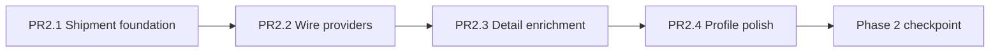

# Phase 2 — Customer API Integration Plan

> **For agentic workers:** Implement one PR at a time. Stop at each checkpoint for user device testing before continuing.

**Goal:** Wire the customer role to real Goods Carrier APIs so home, shipments, profile, and detail flows use backend data instead of dummy/local stores.

**Architecture:** Reuse Phase 1 network stack (`Dio`, `ApiEnvelope`, interceptors, `ApiExceptionMapper`). Add thin `Customer*ApiClient` classes, refactor existing remote shipment repo to match Postman contracts, wire `repository_providers.dart` behind `USE_REMOTE_API`. Keep local repos as fallback.

**Tech stack:** Flutter 3.x, Riverpod, Dio 5, GoRouter, existing clean-architecture layout under `lib/shared/data/api` + `lib/shared/data/repositories/remote/customer/`.

**Prerequisite:** Phase 1 complete — auth, onboarding, profile create/edit, avatar upload, `next_step` routing, bearer token persistence.

---

## Global constraints

- `API_BASE_URL=https://goodscarrier.ajonetech.com`
- `USE_REMOTE_API=true` in `.env`
- All authenticated calls use `Authorization: Bearer <token>` + device headers (already wired)
- Response envelope: `{ success, message, data }` — parse via `ApiEnvelope`
- Customer and driver API layers stay **separate** (no shared shipment repo between roles beyond `IShipmentRepository` driver methods)
- Use `ApiExceptionMapper.userMessage(e)` in all notifiers (no `e.toString()`)
- Use `safeSetState` in screens
- Avatar: upload local file via `POST /api/customer/profile/avatar` first; use returned `user.avatar` path (prefix with `apiBaseUrl` for display)
- Profile create body: `{ name, email?, primary_address_text }` — not `address` / `phone`

---

## Phase 1 recap (done — do not rework)

| Area | Status |
|------|--------|
| Auth OTP + token | ✅ Remote |
| Onboarding role/lang/terms | ✅ Remote |
| Customer profile create/update + avatar | ✅ Remote (`AuthApiClient`) |
| Driver profile create (basic) | ✅ Remote (`AuthApiClient`) |
| Session restore `/api/auth/me` | ✅ |
| Router `next_step` + `profile_completed` gating | ✅ |

---

## Phase 2 scope map

### In scope (customer role)

| Feature | Current data | Target |
|---------|--------------|--------|
| Customer home feed | `DummyTrips` / wrong shipments API | `GET /api/customer/dashboard` |
| My shipments tab | Same | Same API |
| Post / edit shipment | Local repo + client-side price estimate | `POST/PUT /api/customer/shipments` |
| Cancel shipment | Local | `POST /api/customer/shipments/:id/cancel` |
| Assign driver | Local | *Not in Postman collection — Phase 2.3* |
| Shipment detail (interested drivers) | Hardcoded `_demoDriverNames` | API interests endpoint (confirm with Postman) |
| Edit profile | ✅ Already remote | Verify PUT body + avatar flow |
| Pull-to-refresh | Provider `refresh()` exists | Wire to remote |

### Out of scope for Phase 2 (defer to Phase 3/4)

| Feature | Reason |
|---------|--------|
| Driver home / trips / express interest | Phase 3 — driver module |
| Notifications tab | Phase 4 — shared module (`GET /api/notifications`) |
| Saved addresses CRUD | No API client yet — needs Postman contract |
| Reported trips | Dummy only — needs report API |
| Support center FAQs | Static l10n — optional CMS API later |
| Price estimate API | Currently client-side in `shipment_form_screen.dart` |
| Live tracking map | Placeholder UI — needs tracking API |
| Driver earnings | Inline dummy invoices |
| FCM / Razorpay | Session 8 |

---

## Known technical debt (fix in Phase 2)

1. **`RemoteShipmentRepository`** (`lib/shared/data/repositories/remote_shipment_repository.dart`)
   - Does **not** use `ApiEnvelope.parseData` / `ApiException` (unlike auth clients)
   - Passes `customer_id` / `driver_id` query params — backend likely scopes by token (verify against Postman)
   - `Shipment.toJson()` field names may not match API request schema

2. **`repository_providers.dart`** — shipment/trip always local:
   ```dart
   shipmentRepositoryProvider → LocalShipmentRepository  // should toggle like auth
   ```

3. **Detail screen mocks**
   - `shipment_detail_screen.dart` — `_demoDriverNames`
   - `driver_detail_sheet.dart` — `DummyUser.driver`
   - `customer_trip_detail_screen.dart` — `TripDetailDriverCard.fromDummy()`

4. **Missing `ApiConstants` helpers**
   - `GET/PUT /api/customer/shipments/:id`
   - Interests endpoint TBD from Postman

5. **`customer_shipments_provider.dart`** — errors use `e.toString()` not `ApiExceptionMapper`

---

## Recommended delivery — 4 PRs + checkpoint



---

### PR 2.1 — Customer shipment API foundation

**Goal:** Align shipment HTTP layer with Phase 1 patterns before flipping the provider toggle.

**Files:**
- Create: `lib/shared/data/api/customer/customer_shipment_api_client.dart`
- Create: `lib/shared/data/repositories/remote/customer/remote_customer_shipment_repository.dart`
- Modify: `lib/core/network/api_constants.dart` — add `customerShipment(id)`, `customerShipmentInterests(id)` if in Postman
- Modify: `lib/shared/domain/entities/shipment.dart` — `fromJson`/`toJson` aligned to API field names (verify against Postman sample bodies)
- Deprecate/move: `lib/shared/data/repositories/remote_shipment_repository.dart` → split customer methods into new repo or refactor in place

**Tasks:**
- [ ] Pull Postman samples for: list, create, update, cancel, assign, get-by-id
- [ ] Map API fields → `Shipment` entity (status enums, location keys, goods fields)
- [ ] Implement `CustomerShipmentApiClient` using `ApiEnvelope`
- [ ] Remove redundant `customer_id` query param if API uses auth scope
- [ ] Implement cancel as `POST` (Postman: `POST .../cancel`)
- [ ] Assign driver deferred — endpoint not in Postman collection
- [ ] Unit-test `Shipment.fromJson` with real API response JSON (paste from logs)

**Produces:**
```dart
class CustomerShipmentApiClient {
  Future<List<Shipment>> listShipments();
  Future<Shipment> getShipment(String id);
  Future<Shipment> createShipment(Map<String, dynamic> body);
  Future<Shipment> updateShipment(String id, Map<String, dynamic> body);
  Future<void> cancelShipment(String id, {String? reason});
  Future<void> assignDriver(String id, String driverId);
}
```

---

### PR 2.2 — Wire customer providers to remote

**Goal:** Flip customer shipment flows from dummy data to API with minimal UI changes.

**Files:**
- Modify: `lib/core/providers/repository_providers.dart`
- Modify: `lib/features/customer/presentation/providers/customer_shipments_provider.dart`
- Modify: `lib/features/customer/presentation/tabs/customer_home_tab.dart` (error/empty states only if needed)
- Modify: `lib/features/customer/presentation/tabs/customer_shipments_tab.dart`
- Modify: `lib/features/customer/presentation/screens/shipment_form_screen.dart` — map form → API body

**Tasks:**
- [ ] Wire `shipmentRepositoryProvider`:
  ```dart
  if (EnvConfig.useRemoteApi) {
    return RemoteCustomerShipmentRepository(ref.read(customerShipmentApiClientProvider));
  }
  return LocalShipmentRepository(...);
  ```
- [ ] Add `customerShipmentApiClientProvider` in `repository_providers.dart`
- [ ] Replace `e.toString()` with `ApiExceptionMapper.userMessage(e)` in `customer_shipments_provider.dart`
- [ ] Verify `createShipment` / `updateShipment` send correct payload (not raw `Shipment.toJson()` if mismatched)
- [ ] Confirm pull-to-refresh calls `refresh()` → remote list
- [ ] Post-shipment confirmation navigates with server-assigned shipment id
- [ ] Cancel shipment passes cancellation reason if API requires it

**Checkpoint A (after PR 2.2):** User tests on device:
1. Customer home shows API shipments (not dummy names)
2. Create shipment → appears in list after refresh
3. Cancel pending shipment works
4. Airplane mode shows readable error

---

### PR 2.3 — Shipment detail enrichment

**Goal:** Remove hardcoded driver data from customer detail flows.

**Files:**
- Modify: `lib/features/customer/presentation/screens/shipment_detail_screen.dart`
- Modify: `lib/features/customer/presentation/widgets/driver_detail_sheet.dart`
- Modify: `lib/features/customer/presentation/screens/customer_trip_detail_screen.dart`
- Possibly create: `lib/shared/domain/entities/shipment_interest.dart` or extend `Shipment` with `interestedDrivers`
- Extend: `CustomerShipmentApiClient` + repo with interests/list-drivers endpoint

**Tasks:**
- [ ] Confirm Postman endpoint for interested drivers (e.g. `GET /api/customer/shipments/:id/interests`)
- [ ] Parse driver card fields: name, rating, vehicle, quoted price, avatar URL
- [ ] Use `ProfileImageUtils.resolveNetworkUrl` for driver avatars
- [ ] Wire assign driver CTA to `assignDriver` API
- [ ] Remove `_demoDriverNames` and `DummyUser` from customer detail path
- [ ] Loading / empty / error states on detail screen

**Checkpoint B:** User tests:
1. Open shipment with interests → real driver list from API
2. Assign driver → status updates
3. Driver avatar loads from `baseUrl + avatar path`

---

### PR 2.4 — Customer profile & edit polish

**Goal:** Harden profile flows discovered during Phase 1 testing (mostly done — verify + small fixes).

**Files:**
- Modify: `lib/shared/data/api/auth/auth_api_client.dart` — ensure PUT profile uses `primary_address_text`
- Modify: `lib/features/customer/presentation/screens/customer_edit_profile_screen.dart`
- Modify: `lib/features/auth/presentation/screens/customer_profile_setup_screen.dart`
- Modify: `lib/shared/presentation/profile/app_profile_tab.dart` — show remote avatar

**Tasks:**
- [ ] Verify edit profile calls `PUT /api/customer/profile` (not local-only persist)
- [ ] After profile save, `authProvider.user` updated from API response (including `avatar`, `primary_address`)
- [ ] Edit screen: new photo → avatar upload → then profile PUT
- [ ] Profile tab reflects server avatar immediately after save
- [ ] Optional: move customer profile methods from `AuthApiClient` → `CustomerProfileApiClient` (cleaner module boundary — only if time permits)

---

## Phase 2 full verification checklist

Run as **customer** with `USE_REMOTE_API=true`:

| # | Test | Expected |
|---|------|----------|
| 1 | Login → complete onboarding → customer home | Real API data, not dummy shipment titles |
| 2 | Pull to refresh on home | `GET /api/customer/shipments` in logs |
| 3 | Create shipment (all required fields) | `POST` success; shipment in My Shipments |
| 4 | Edit draft/pending shipment | `PUT` success |
| 5 | Cancel shipment | `PATCH .../cancel`; status updates |
| 6 | Shipment detail → interested drivers | API list, not hardcoded names |
| 7 | Assign driver | `PATCH .../assign`; shipment status changes |
| 8 | Edit profile (name, address, email) | `PUT /api/customer/profile` |
| 9 | Change profile photo | `POST .../avatar` then profile update; image shows on profile tab |
| 10 | Kill app → reopen | Session restored; shipments reload |
| 11 | Logout → login as same user | Shipments persist server-side |
| 12 | Network off during list load | User-readable error, no crash |

**Stop here.** User approves before Phase 3 (driver module).

---

## Phase 3 preview (driver — not started)

| PR | Scope |
|----|-------|
| PR 3.1 | `DriverTripApiClient` + refactor `RemoteTripRepository` |
| PR 3.2 | Wire `tripRepositoryProvider` + `driverShipmentRequestsProvider` |
| PR 3.3 | Driver profile page + avatar (mirror customer pattern) |
| PR 3.4 | Trip detail interested customers + express interest |

---

## Phase 4 preview (shared — not started)

| PR | Scope |
|----|-------|
| PR 4.1 | `NotificationsApiClient` + repo; replace `DummyNotifications` |
| PR 4.2 | `CustomerAddressApiClient` + saved addresses screens |
| PR 4.3 | Report trip API + reported trips list |
| PR 4.4 | Settings sync (language/push) if backend exposes endpoints |

---

## Risks & mitigations

| Risk | Mitigation |
|------|------------|
| `Shipment.toJson()` doesn't match API | Capture real Postman bodies first; add request DTO mapper separate from entity |
| List response shape differs (pagination/meta) | Log first response; extend `ApiEnvelope` parser if `data` is nested |
| `customer_id` in query rejected or ignored | Drop query param; rely on token; test with logged-in user only |
| Interests endpoint missing or different path | Block PR 2.3 on Postman confirmation; keep mock as fallback behind flag |
| Large shipment lists slow UI | Defer `compute()` parsing until list > 100 items proves necessary |
| Driver methods still on `IShipmentRepository` | Keep interface for now; customer repo implements customer ops only in Phase 2 |

---

## Open questions (resolve before PR 2.1 coding)

1. **Exact Postman request/response bodies** for `POST /api/customer/shipments` — need sample JSON from collection or live API log
2. **Interests endpoint** — path and response shape for driver list on shipment detail
3. **Does list endpoint filter by status** or return all? (tabs: Active / Completed / Cancelled)
4. **Cancel body** — is `reason` required?
5. **Assign driver** — single driver id or interest id?

**Action:** Export or screenshot Postman **Customer → Shipments** folder before implementation starts.

---

## Suggested first task when you say "start Phase 2"

Begin **PR 2.1** only:
1. Read Postman shipment endpoints
2. Log one real `GET /api/customer/shipments` response from a test account
3. Align `Shipment.fromJson`
4. Build `CustomerShipmentApiClient`
5. Do **not** flip `repository_providers` until client parses real responses correctly
