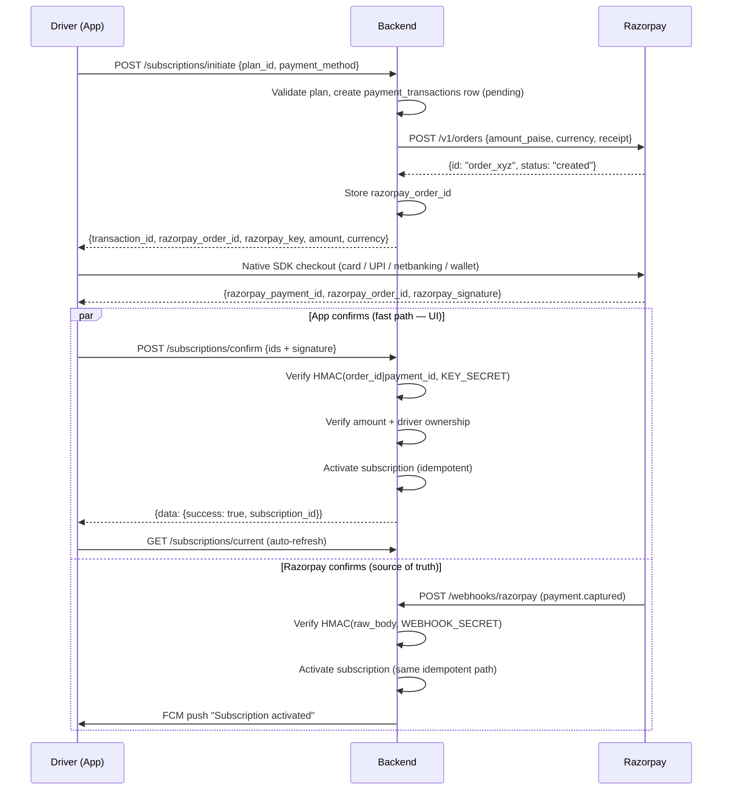

# Razorpay Subscription Payments — Backend Implementation Guide

Contract between the Goods Carrier Flutter app and the backend for driver subscription payments via Razorpay.

**Audience:** backend team.
**Status:** app side is implemented and merged. Backend side is not started. Nothing charges money until sections 6 and 8 are done.

> **Supersedes** the payment parts of [`driver_subscription_payments_api.md`](./driver_subscription_payments_api.md). That document was written before Razorpay was chosen and describes a generic `payment_url` / `upi_intent` gateway. The app no longer uses those two fields. Plans, payment history, detail and invoice endpoints in that document are still accurate.

---

## 1. Ownership split

The Flutter app already does all of this — no mobile work is pending for the happy path:

1. Lists plans and lets the driver pick one and a payment method
2. Calls `POST /api/driver/subscriptions/initiate`
3. Opens the native Razorpay SDK with the `order_id` you return
4. Receives `razorpay_payment_id`, `razorpay_order_id`, `razorpay_signature` from the SDK
5. Posts all three to `POST /api/driver/subscriptions/confirm`
6. Shows the success or failure receipt screen

Your side owns:

1. **Create** a Razorpay order server-side using the Key Secret (section 6)
2. **Verify** the checkout signature on confirm before granting anything (section 7)
3. **Receive webhooks** as the authoritative source of payment truth (section 8)
4. **Activate / extend** the subscription and write the payment history row (section 9)
5. **Push** a notification when the webhook settles the payment (section 10)

### Why the app cannot do this alone

Creating a Razorpay order requires the **Key Secret**. Anything shipped in the app binary is extractable, so the secret can only live on your server. Without a server-created `order_id` there is no order to pay, and the app deliberately refuses to open checkout — it shows *"Payment gateway is not configured. Contact support."* This is the current behaviour on `develop` today.

---

## 2. Credentials

| Credential | Value | Lives in |
|---|---|---|
| Test Key ID | `rzp_test_TLN1dDgRJcxeqG` | app `.env` **and** backend env |
| Test Key Secret | *(shared separately — see note)* | **backend env only** |
| Live Key ID | not yet issued | app `.env` + backend env |
| Live Key Secret | not yet issued | **backend env only** |
| Webhook Secret | you generate it in the dashboard | **backend env only** |

> **The Key Secret must never be committed, logged, or returned in an API response.** It was shared over chat, which means the test secret should be treated as compromised and rotated in the Razorpay dashboard before go-live. Live credentials must be exchanged through a password manager or server-side secret store, never chat or email.

The **Webhook Secret is a different value from the Key Secret** (section 8.2). Mixing these two up is the single most common cause of "all my webhooks return 400".

### Test vs live must match on both sides

The app sends a publishable Key ID; you create the order on whichever account your secret belongs to. A live key cannot pay a test order and vice versa. The app selects its key from `RAZORPAY_MODE=test|live` in `.env`, so **tell the mobile team whenever you switch the backend between test and live.**

Safest option: return `razorpay_key` in the initiate response (section 6.2). The app prefers that value over its own `.env`, which makes the backend the single source of truth and removes the mismatch class of bug entirely. **Please do this.**

---

## 3. Non-negotiables

These are not style preferences. Each one maps to a way real money or real access gets lost.

| Rule | Why |
|---|---|
| `amount` in the initiate response is **integer paise** | Razorpay rejects decimals. `₹499.00` → `49900` |
| Never trust `payment_status` from the app | It is a client-supplied hint. A malicious client can POST `success` |
| Only grant a subscription after **signature verification** | This is the only proof a payment happened |
| Re-check the amount server-side before activating | Blocks a tampered order from buying an expensive plan cheaply |
| Scope every query by the authenticated driver | Prevents confirming somebody else's transaction (IDOR) |
| The webhook handler must be **idempotent** | Razorpay retries on any non-2xx, and confirm + webhook both arrive |
| The webhook route must skip auth and CSRF | Razorpay cannot present a Bearer token |
| The **webhook is the source of truth**, not confirm | The app can be killed mid-payment; the webhook still lands |

---

## 4. End-to-end flow



The two branches race by design. Section 9 defines how they converge safely.

---

## 5. Conventions the app already enforces

### Envelope

Every response must use:

```json
{ "success": true, "message": "…", "data": { } }
```

The app throws a user-visible error when `success` is `false`, using `message` as the text. Keep `message` human-readable and localised via `Accept-Language`.

### Headers the app sends

| Header | Example | Notes |
|---|---|---|
| `Authorization` | `Bearer 23\|abc…` | Sanctum token. Required on all four endpoints |
| `Accept` | `application/json` | |
| `Content-Type` | `application/json` | |
| `Accept-Language` | `en` / `hi` / `gu` | Localise `message` |
| `X-Device-Id` | `eBTq_x19DKgziwHeQpyqkQ` | Stable per install |
| `X-Device-Type` | `ios` / `android` | |
| `X-FCM-Token` | `dXy9…:APA91b…` | Needed to push in section 10 |

### Money units — read this twice

| Field | Endpoint | Unit | Example for a ₹499 plan |
|---|---|---|---|
| `price` | `GET /subscription-plans` | **rupees** (decimal) | `499.00` |
| `amount` | `POST /subscriptions/initiate` | **integer paise** | `49900` |
| `amount` | `GET /payment-history` | **rupees** (decimal) | `499.00` |

Only the initiate response uses paise, because that is what the Razorpay SDK requires. The app no longer guesses: it sends whatever you return straight to Razorpay. If you send `499` there, Razorpay sees ₹4.99 and the order will not match, producing a hard checkout error.

You may name the field `amount_paise` instead of `amount` if you prefer explicitness — the app accepts either and prefers `amount_paise`.

---

## 6. Endpoints

### 6.1 `GET /api/driver/subscription-plans`

Already working. Unchanged. For reference, the app reads:

```json
{
  "success": true,
  "data": [
    {
      "id": 2,
      "name": "Professional Plan",
      "tagline": "Best for scaling fleets",
      "description": "…",
      "price": 499.00,
      "currency": "INR",
      "duration_days": 30,
      "is_active": true,
      "is_recommended": true,
      "features": ["Priority route access", "Unlimited bids"]
    }
  ]
}
```

`features` accepts an array of strings, or of objects with a `label` / `name` / `text` key. The app hides plans where `is_active` is `false`. If no plan has `is_recommended`, the app highlights the middle one by price.

---

### 6.2 `POST /api/driver/subscriptions/initiate`

This is the endpoint that needs the most new work.

**Request from app:**

```json
{ "plan_id": 2, "payment_method": "upi" }
```

`payment_method` is one of `upi`, `card`, `netbanking`, `wallet`. It is the driver's stated preference, used to preselect a tab in the Razorpay sheet. **It is not a restriction** — the driver may still pay by another method, so record the actual method from the webhook, not this value.

**Required behaviour:**

1. Authenticate the driver; reject non-drivers with `403`
2. Load the plan by `plan_id`; `404` if missing, `422` if `is_active` is false
3. Reject if the driver already has an active non-expired subscription, unless you intend to support renewal stacking — decide this and tell the mobile team (section 13)
4. **Reuse before create:** if a `pending` transaction for this driver+plan exists and is younger than ~15 minutes, return its existing `razorpay_order_id` instead of creating a second order. Drivers tap "Secure Pay" repeatedly on slow networks; each tap otherwise creates an orphan order.
5. Create the local `payment_transactions` row with status `pending`
6. Create the Razorpay order (below)
7. Persist `razorpay_order_id` on that row
8. Return the payload below

**Creating the order:**

```bash
curl -u "$RAZORPAY_KEY_ID:$RAZORPAY_KEY_SECRET" \
  -X POST https://api.razorpay.com/v1/orders \
  -H 'Content-Type: application/json' \
  -d '{
    "amount": 49900,
    "currency": "INR",
    "receipt": "TXN-982340",
    "notes": { "driver_id": "17", "plan_id": "2", "transaction_id": "TXN-982340" }
  }'
```

Laravel with the official SDK (`composer require razorpay/razorpay`):

```php
$api = new \Razorpay\Api\Api(config('razorpay.key_id'), config('razorpay.key_secret'));

$order = $api->order->create([
    'amount'   => (int) round($plan->price * 100), // paise, integer
    'currency' => 'INR',
    'receipt'  => $txn->transaction_id,            // max 40 chars
    'notes'    => [
        'driver_id'      => (string) $driver->id,
        'plan_id'        => (string) $plan->id,
        'transaction_id' => $txn->transaction_id,
    ],
]);

$txn->update(['razorpay_order_id' => $order['id']]);
```

Notes on the order call:

- `amount` must be an integer ≥ `100` (₹1 minimum for INR)
- `receipt` is capped at 40 characters
- Put `driver_id`, `plan_id` and `transaction_id` in `notes` — the webhook echoes them back, which is what lets you resolve a webhook to a driver without a lookup table
- Enable auto-capture in **Dashboard → Settings → Payment Capture**, otherwise payments sit in `authorized` and you must capture manually via `POST /v1/payments/:id/capture`. Confirm which mode the account uses and tell us, because it changes which webhook event settles the payment.
- Wrap this in a try/catch. If Razorpay is down, mark the transaction `failed` and return `502` with a readable `message` — do not leave a `pending` row with no order.

**Response the app expects:**

```json
{
  "success": true,
  "message": "Payment initiated",
  "data": {
    "transaction_id": "TXN-982340",
    "status": "pending",
    "razorpay_order_id": "order_PqRs123AbCdEf",
    "razorpay_key": "rzp_test_TLN1dDgRJcxeqG",
    "amount": 49900,
    "currency": "INR"
  }
}
```

| Field | Required | Notes |
|---|---|---|
| `transaction_id` | Yes | Your reference. Echoed back on confirm and shown on the receipt |
| `razorpay_order_id` | **Yes** | Without it the app refuses to open checkout. `order_id` also accepted |
| `amount` | **Yes** | Integer paise, must equal the order amount. `amount_paise` also accepted |
| `razorpay_key` | Strongly recommended | Publishable Key ID. Removes test/live mismatch. `key` also accepted |
| `currency` | No | Defaults to `INR` |
| `status` | No | Defaults to `pending` |

`payment_url` and `upi_intent` are ignored — do not implement them.

---

### 6.3 `POST /api/driver/subscriptions/confirm`

**Request from app** (the last three fields are new; the app sends them today):

```json
{
  "transaction_id": "TXN-982340",
  "gateway_transaction_id": "pay_PqRs456XyZ",
  "payment_status": "success",
  "razorpay_order_id": "order_PqRs123AbCdEf",
  "razorpay_payment_id": "pay_PqRs456XyZ",
  "razorpay_signature": "9ef4dffbfd84f1318f6739a3ce19f9d85851857ae648f114332d8401e0949a3d"
}
```

`payment_status` is `success` or `failed`. **Treat it as a hint with no authority.** The signature is the only proof.

**Required behaviour, in this order:**

1. Load the transaction by `transaction_id` **scoped to the authenticated driver**. `404` if it does not belong to them — never `403` with details, and never look it up unscoped.
2. If already `success`, return `200` with the existing subscription. This endpoint is retried; it must be idempotent.
3. Verify the signature:

```php
use Razorpay\Api\Api;

$api = new Api(config('razorpay.key_id'), config('razorpay.key_secret'));

try {
    $api->utility->verifyPaymentSignature([
        'razorpay_order_id'   => $request->razorpay_order_id,
        'razorpay_payment_id' => $request->razorpay_payment_id,
        'razorpay_signature'  => $request->razorpay_signature,
    ]);
} catch (\Razorpay\Api\Errors\SignatureVerificationError $e) {
    $txn->update(['status' => 'failed', 'failure_reason' => 'signature_mismatch']);
    return response()->json([
        'success' => false,
        'message' => __('Payment could not be verified.'),
        'data'    => ['success' => false],
    ], 422);
}
```

The algorithm, if you implement it by hand:

```
expected = HMAC_SHA256(razorpay_order_id + "|" + razorpay_payment_id, KEY_SECRET)
valid    = hash_equals(expected, razorpay_signature)
```

Use `hash_equals`, not `==`, to avoid a timing side channel.

4. Verify `razorpay_order_id` matches the `razorpay_order_id` stored on that transaction. A valid signature for *a different order* is still a forgery attempt in this context.
5. Fetch the payment from Razorpay (`$api->payment->fetch($paymentId)`) and confirm `amount` equals the expected plan amount in paise and `status` is `captured` or `authorized`. This blocks a tampered client from paying ₹1 for a ₹499 plan.
6. Activate the subscription through the **same shared, idempotent service the webhook uses** (section 9).
7. Return the payload below.

**Response — the nesting matters:**

```json
{
  "success": true,
  "message": "Subscription activated",
  "data": {
    "success": true,
    "message": "Subscription activated",
    "subscription_id": "148"
  }
}
```

> **`data.success` is required.** The app reads `success` from inside `data` when `data` is an object, and only falls back to the root when it is not. If you return `{"success": true, "data": {"subscription_id": 148}}` the app reads `data.success` as absent → `false` → **the driver sees "Payment failed" on a payment that actually succeeded.** Duplicating `success` and `message` at both levels is the safe shape.

On genuine failure, return `data.success: false` with a `message` explaining why. The app shows that text on the failure screen.

---

### 6.4 `GET /api/driver/subscriptions/current`

```json
{
  "success": true,
  "data": {
    "id": 148,
    "plan_id": 2,
    "plan_name": "Professional Plan",
    "status": "active",
    "start_date": "2026-08-04T10:12:00Z",
    "end_date": "2026-09-03T10:12:00Z",
    "is_expired": false
  }
}
```

When the driver has no subscription, return `200` with `"data": {}` or `"data": null`. The app maps an empty object to "no subscription". A `404` also works but is noisier in logs.

Dates must be ISO 8601 parseable. **The app now displays `end_date` from this endpoint as the expiry on the success receipt**, calling it immediately after a successful confirm. If it is stale or wrong, the driver sees a wrong expiry date. It falls back to `now + duration_days` only when this call fails.

---

## 7. Signature verification — the two different secrets

This trips up nearly every first implementation:

| | Checkout confirm (section 6.3) | Webhook (section 8) |
|---|---|---|
| Signed payload | `order_id + "\|" + payment_id` | the **raw request body bytes** |
| Secret | **Key Secret** | **Webhook Secret** |
| Arrives in | JSON field `razorpay_signature` | header `X-Razorpay-Signature` |
| Algorithm | HMAC-SHA256, hex | HMAC-SHA256, hex |

For the webhook you must hash the **raw, unparsed body**. Re-serialising the decoded JSON reorders keys and changes whitespace, and the signature will never match. In Laravel use `$request->getContent()`, and make sure no middleware has consumed or rewritten the body first.

---

## 8. Webhook — `POST /api/webhooks/razorpay`

This is what makes the flow survive reality: the app being killed mid-payment, the driver losing signal after paying, or a UPI collect request approved ten minutes later. **Without this, drivers will pay and not get their subscription.**

### 8.1 Dashboard setup

Dashboard → Settings → Webhooks → Add New Webhook:

- **URL:** `https://goodscarrier.ajonetech.com/api/webhooks/razorpay`
- **Secret:** generate a strong random string, store as `RAZORPAY_WEBHOOK_SECRET`
- **Events:** `payment.captured`, `payment.failed`, `order.paid`, and `refund.processed` if you plan to support refunds

Register the webhook separately on the test and live accounts — they are independent.

### 8.2 Handler requirements

1. **Route must be public.** No `auth:sanctum`, no CSRF. Razorpay cannot authenticate.
2. **Verify the signature first**, before parsing or touching the database:

```php
$raw       = $request->getContent();
$signature = $request->header('X-Razorpay-Signature', '');

try {
    (new \Razorpay\Api\Api(config('razorpay.key_id'), config('razorpay.key_secret')))
        ->utility->verifyWebhookSignature($raw, $signature, config('razorpay.webhook_secret'));
} catch (\Razorpay\Api\Errors\SignatureVerificationError $e) {
    Log::warning('razorpay.webhook.bad_signature');
    return response()->json(['success' => false], 400);
}
```

3. **Persist the raw event before processing.** A `razorpay_webhook_events` row with the raw payload gives you replay ability when a handler bug eats an event.
4. **Deduplicate.** Razorpay retries on any non-2xx, and can deliver the same event more than once. Use the payment id plus event name as a unique key and no-op on a repeat.
5. **Return `2xx` quickly.** Anything else triggers retries. If your own processing fails, still return `200` after storing the raw event, then reprocess from your queue — otherwise a transient bug turns into a retry storm.
6. **Do not assume ordering.** `payment.failed` for a retried attempt can arrive after `payment.captured` for the successful one. Never downgrade a transaction that is already `success`.

### 8.3 Event handling

| Event | Action |
|---|---|
| `payment.captured` | Money settled. Activate/extend the subscription (section 9). Primary success signal |
| `order.paid` | Order fully paid. Same idempotent activation. Fires alongside `payment.captured` — dedupe, don't double-extend |
| `payment.failed` | Mark transaction `failed` with `failure_reason`, **only if not already `success`**. Push a failure notification |
| `refund.processed` | Revoke or shorten the subscription, mark the payment refunded |

Resolving the event to a driver:

```php
$payment = $data['payload']['payment']['entity'];

$orderId   = $payment['order_id'];              // preferred lookup key
$paymentId = $payment['id'];
$amount    = $payment['amount'];                 // paise
$method    = $payment['method'];                 // actual method used
$txnRef    = $payment['notes']['transaction_id'] ?? null;

$txn = PaymentTransaction::where('razorpay_order_id', $orderId)->first()
    ?? PaymentTransaction::where('transaction_id', $txnRef)->first();
```

Look up by `razorpay_order_id` first and fall back to `notes.transaction_id`. Before activating, **re-verify `$amount` against the plan price in paise** — the webhook is trustworthy about what was paid, not about what should have been paid.

Record `$payment['method']` as the real payment method. The driver's pre-selection from initiate is only a UI hint.

---

## 9. Activation: reconciling confirm and webhook

Both paths call **one shared service**, which must be safe to call any number of times:

```php
public function activate(PaymentTransaction $txn, string $paymentId, int $amountPaise): Subscription
{
    return DB::transaction(function () use ($txn, $paymentId, $amountPaise) {
        // Row lock so confirm and webhook cannot both activate.
        $txn = PaymentTransaction::whereKey($txn->id)->lockForUpdate()->first();

        if ($txn->status === 'success') {
            return $txn->subscription;           // already done — no double extension
        }

        $plan = $txn->plan;
        abort_unless($amountPaise === (int) round($plan->price * 100), 422, 'Amount mismatch');

        // Extend an unexpired subscription, otherwise start from now.
        $existing = Subscription::where('driver_id', $txn->driver_id)
            ->where('status', 'active')->where('end_date', '>', now())
            ->latest('end_date')->first();

        $start = $existing?->end_date ?? now();

        $subscription = Subscription::create([
            'driver_id'  => $txn->driver_id,
            'plan_id'    => $plan->id,
            'status'     => 'active',
            'start_date' => $start,
            'end_date'   => $start->copy()->addDays($plan->duration_days),
        ]);

        $txn->update([
            'status'                 => 'success',
            'gateway_transaction_id' => $paymentId,
            'subscription_id'        => $subscription->id,
            'paid_at'                => now(),
        ]);

        return $subscription;
    });
}
```

The `lockForUpdate` plus the early `success` return is what makes the race in section 4 harmless. **Whichever path arrives first activates; the second becomes a no-op.** Without the lock, confirm and the webhook landing within the same millisecond grant 60 days for one payment.

Writing the `payment_transactions` row to `success` is also what makes `GET /api/driver/payment-history` show the payment — that screen is already live in the app and reads from the same table.

---

## 10. Telling the app the status changed

When the webhook settles a payment, the driver may not be looking at the app. Two mechanisms, both needed:

### Push notification

Send FCM to the driver's devices using the tokens captured from `X-FCM-Token` (full setup in [`fcm_push_notifications_backend.md`](./fcm_push_notifications_backend.md)).

```json
{
  "message": {
    "token": "dXy9…:APA91b…",
    "notification": {
      "title": "Subscription activated",
      "body": "Your Professional Plan is active until 3 Sep 2026."
    },
    "data": {
      "type": "payment_success",
      "transaction_id": "TXN-982340",
      "subscription_id": "148"
    }
  }
}
```

> The `notification` block is **mandatory**. The app skips display entirely for data-only messages, so a data-only push is silently invisible in the foreground.

Use `type` values the app's notification list already understands: **`payment_success`** or **`subscription_purchase`** for success, and `payment` as an alias. An unrecognised `type` silently falls back to a shipment icon, so use these exact strings.

### Notification record

Also insert a row so it appears in `GET /api/notifications` with the same `type`, a `title`, a `body`, `created_at`, and `is_read: false`. Push is best-effort — permission may be denied, or the token stale — so the in-app list is the reliable channel.

Deep linking from a tapped notification into the receipt screen is **not implemented in the app yet** (`FcmService.onNotificationOpened` has no subscriber). Send the `data` keys above anyway and mobile will wire it up; the notification itself works today.

---

## 11. Edge cases to handle explicitly

| Scenario | Expected behaviour |
|---|---|
| Driver taps Pay twice quickly | Reuse the pending order (6.2 step 4). Never two orders for one intent |
| App killed after paying, before confirm | Webhook activates. Driver sees it on next `GET /current` |
| Driver cancels in the Razorpay sheet | No confirm arrives. Transaction stays `pending`. Expire it via a scheduled job after ~30 min |
| Payment fails (insufficient funds) | App posts `payment_status: failed`; `payment.failed` webhook confirms. Mark `failed` + reason |
| Confirm arrives with a valid signature for a different order | Reject `422`. Signature alone is not enough (6.3 step 4) |
| Confirm replayed after success | Return `200` with the existing subscription. No second extension |
| `payment.captured` arrives twice | Dedupe on payment id. One activation |
| `payment.failed` arrives after success | Ignore. Never downgrade a `success` transaction |
| Amount in webhook ≠ plan price | Do **not** activate. Alert. Likely tampering or a plan price change mid-flow |
| Plan price changes while a payment is in flight | Validate against the price snapshot stored on the transaction, not the live plan row |
| Driver already has an active subscription | Decide: block, or extend from `end_date` (section 9 extends). Confirm with mobile |
| Razorpay Orders API times out | Mark `failed`, return `502` with a readable message. No dangling `pending` |
| Webhook arrives for an unknown order | Log and return `200`. Do not 500 — it triggers retries forever |

---

## 12. Backend environment variables

```dotenv
RAZORPAY_KEY_ID=rzp_test_TLN1dDgRJcxeqG
RAZORPAY_KEY_SECRET=<test secret — rotate the one shared over chat>
RAZORPAY_WEBHOOK_SECRET=<generated in dashboard, NOT the key secret>
RAZORPAY_MODE=test
```

Never log `RAZORPAY_KEY_SECRET` or `RAZORPAY_WEBHOOK_SECRET`. Scrub `razorpay_signature` and `X-Razorpay-Signature` from request logs.

---

## 13. Test plan

Razorpay test-mode instruments (confirm current values in Dashboard → Test Mode docs):

- **Card:** `4111 1111 1111 1111`, any future expiry, any CVV
- **UPI success:** `success@razorpay`
- **UPI failure:** `failure@razorpay`
- **Netbanking:** pick any bank, then choose Success or Failure on the simulated page

### Backend checks

- [ ] Order created with integer paise; `amount` echoed in initiate equals the order amount
- [ ] `data.success` present in the confirm response (section 6.3 warning)
- [ ] Tampered `razorpay_signature` → `422`, no subscription created
- [ ] Valid signature for a *different* order → `422`
- [ ] Confirming another driver's `transaction_id` → `404`, no data leaked
- [ ] Confirm called twice → one subscription, one payment row
- [ ] Webhook with a bad signature → `400`
- [ ] Same `payment.captured` delivered twice → one activation
- [ ] `payment.failed` after `payment.captured` → stays `success`
- [ ] Webhook amount ≠ plan price → no activation, alert raised
- [ ] Confirm and webhook fired concurrently → exactly one subscription (run it twice, it's a race)
- [ ] Secrets absent from logs and from every API response

### End-to-end with the app

1. Driver opens Subscription → picks a plan → picks UPI → taps Secure Pay
2. Razorpay sheet opens with the correct amount and UPI preselected
3. Pay with `success@razorpay`
4. App shows the success receipt with the correct plan, amount and expiry
5. `GET /current` returns the new subscription; `GET /payment-history` shows the payment
6. Push notification arrives
7. Repeat, but **force-kill the app** right after paying → subscription still activates via webhook, and is visible on relaunch
8. Repeat with `failure@razorpay` → failure screen, no subscription, transaction `failed`

Step 7 is the one that proves the webhook path actually works. Please do not skip it.

---

## 14. Open questions for the backend team

Answer these and send them back to mobile — two of them change app behaviour:

1. **Auto-capture on or off?** Decides whether `payment.captured` or `payment.authorized` settles the payment.
2. **Renewal policy:** block a purchase while a subscription is active, or extend from `end_date`? Section 9 assumes extend. The app currently offers plans regardless.
3. **Are you returning `razorpay_key` in initiate?** Please do. Removes the whole test/live mismatch class.
4. **Pending expiry window** for abandoned checkouts — 30 minutes?
5. **Refund policy:** in scope for v1? If yes, what happens to a subscription mid-term?
6. **`GET /current` when none exists:** `200` with `{}` or `404`? Either works; state which.

---

## 15. Definition of done

- [ ] `POST /subscriptions/initiate` returns a real `razorpay_order_id`, integer paise `amount`, and `razorpay_key`
- [ ] `POST /subscriptions/confirm` verifies the signature, the order ownership, and the amount before granting anything
- [ ] Confirm response includes `data.success`
- [ ] `POST /api/webhooks/razorpay` is live, signature-verified, idempotent, and registered on both test and live accounts
- [ ] Activation is a single shared, row-locked, idempotent service used by both confirm and webhook
- [ ] `payment_transactions` rows are written so payment history and invoices populate
- [ ] FCM push and a notification record on settlement
- [ ] Test secret rotated; no secret in git, logs, or responses
- [ ] Section 13 checklist green, including step 7

---

*Owner: mobile team. Keep this in sync with the app implementation. App-side entry points: `lib/features/driver/presentation/screens/driver_subscription_payment_method_screen.dart`, `lib/core/services/razorpay_payment_service.dart`, `lib/shared/data/api/driver/driver_subscription_api_client.dart`.*
